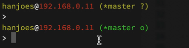

[](https://travis-ci.org/hanjoes/swift-prompt)

# Swift Prompt

Prompt command executor built using Swift. 

# Features

## Information Rich
It provides below information:
* user login
* host ip address
* git status

## Non-blocking
The "swift_prompt_nanny" is a daemon meant for synchronizing your repository with remote. It kicks in every set amount of seconds (currently hard-coded 10s). Press "ENTER" to continue if you see a question mark blinking (shown in the demo below).

# Usage

Add the following line to your shell application's resource file:

```bash
PROMPT_COMMAND="/path/to/swift_prompt" # make sure nanny is in the same folder
PS1 = "> " # or your favourate prompt script.
```

# Demo

